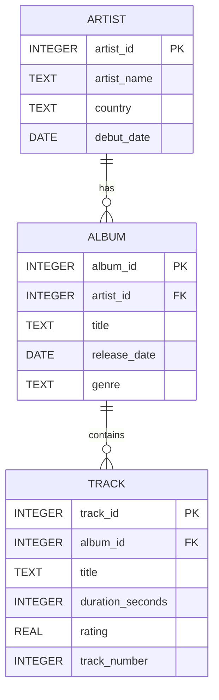

# ER-diagram – Musikbibliotek

## Tabellförklaringar

### Artist
Lagrar grunddata om artister. `artist_id` är primärnyckel för unik identifiering. `artist_name` sätts till `TEXT` eftersom namn har varierande längd. `country` sparas som textkod/landnamn och `debut_date` som `DATE` för att kunna filtrera per period.

### Album
Representerar album och kopplas till exakt en artist via `artist_id` (FK). `title` och `genre` är `TEXT`. `release_date` är `DATE` för tidsbaserade sökningar och sortering.

### Track
Innehåller låtar som hör till ett album via `album_id` (FK). `duration_seconds` är `INTEGER` eftersom längd i sekunder är heltal. `rating` är `REAL` för att tillåta decimalbetyg (t.ex. 4.7). `track_number` är `INTEGER` för ordning i albumet.

## Relationer och constraints

1. **Artist (1) → (N) Album**: en artist kan ha flera album, men varje album tillhör en artist.
2. **Album (1) → (N) Track**: ett album kan innehålla flera tracks, men varje track tillhör ett album.
3. **PK/FK-motivering**: primärnycklar säkerställer unikhet, och främmande nycklar säkerställer referentiell integritet så att album och tracks alltid pekar på befintliga rader.
4. **NOT NULL på kritiska fält** (namn, titel, relationer) förhindrar ofullständig data i kärnflödet.
