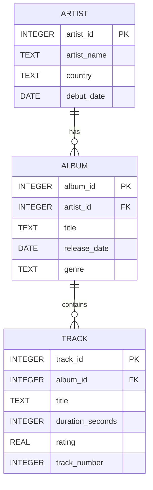

# Rapport – SQL & Databasdesign (Musikbibliotek)

## 1. ER-diagram

Samma modell som i `docs/er_diagram.md`:



## 2. Tabellförklaringar och motiveringar

**Artist** lagrar artistens identitet och metadata. `artist_id` är `INTEGER` för enkel, snabb nyckelhantering. `artist_name` och `country` är `TEXT` eftersom värdena varierar i längd. `debut_date` är `DATE` för att möjliggöra tidsbaserade filtreringar.

**Album** lagrar utgåvor och kopplar varje album till en artist via `artist_id` (FK). `title` och `genre` är `TEXT` eftersom de är fria textvärden. `release_date` är `DATE` för sortering och jämförelser över tid.

**Track** innehåller låtar för ett album via `album_id` (FK). `duration_seconds` är `INTEGER` eftersom sekunder är heltal. `rating` är `REAL` för decimalvärden mellan 0 och 5. `track_number` är `INTEGER` då spårnummer är ordinaldata.

`NOT NULL` används på fält som måste finnas för att posten ska vara meningsfull (t.ex. namn, titel, relationer). `CHECK` används för kvalitetssäkring, exempelvis positiv låtlängd och betyg inom giltigt intervall.

## 3. Alla SQL-kommandon

### create_tables.sql

```sql
-- Enable FK checks in SQLite sessions.
PRAGMA foreign_keys = ON;

-- Artist stores one row per music artist and acts as the parent entity for albums.
CREATE TABLE IF NOT EXISTS Artist (
    artist_id INTEGER PRIMARY KEY,
    artist_name TEXT NOT NULL,
    country TEXT NOT NULL,
    debut_date DATE NOT NULL
);

-- Album stores releases and links each album to exactly one artist.
CREATE TABLE IF NOT EXISTS Album (
    album_id INTEGER PRIMARY KEY,
    artist_id INTEGER NOT NULL,
    title TEXT NOT NULL,
    release_date DATE NOT NULL,
    genre TEXT NOT NULL,
    FOREIGN KEY (artist_id) REFERENCES Artist(artist_id)
);

-- Track stores songs and links each track to one album while keeping useful metadata.
CREATE TABLE IF NOT EXISTS Track (
    track_id INTEGER PRIMARY KEY,
    album_id INTEGER NOT NULL,
    title TEXT NOT NULL,
    duration_seconds INTEGER NOT NULL CHECK (duration_seconds > 0),
    rating REAL CHECK (rating BETWEEN 0 AND 5),
    track_number INTEGER NOT NULL CHECK (track_number > 0),
    FOREIGN KEY (album_id) REFERENCES Album(album_id)
);
```

### insert_data.sql

```sql
-- Insert artists first because Album depends on Artist via artist_id.
INSERT INTO Artist (artist_id, artist_name, country, debut_date) VALUES
    (1, 'Northern Echo', 'Sweden', '2012-04-19'),
    (2, 'Velvet Circuit', 'UK', '2015-09-02'),
    (3, 'Solar Harbor', 'Canada', '2010-01-14');

-- Insert albums second because Track depends on Album and Album depends on Artist.
INSERT INTO Album (album_id, artist_id, title, release_date, genre) VALUES
    (1, 1, 'Midnight Transit', '2016-03-11', 'Indie Pop'),
    (2, 1, 'Static Horizon', '2019-10-04', 'Synthwave'),
    (3, 2, 'Signal Bloom', '2018-06-22', 'Alternative Rock'),
    (4, 3, 'Tidal Lights', '2021-02-12', 'Dream Pop');

-- Insert tracks last because each track must reference an existing album_id.
INSERT INTO Track (track_id, album_id, title, duration_seconds, rating, track_number) VALUES
    (1, 1, 'City in Reverse', 214, 4.2, 1),
    (2, 1, 'Neon Rainfall', 189, 4.0, 2),
    (3, 1, 'Glass Platforms', 241, 4.5, 3),
    (4, 2, 'Voltage Tide', 202, 4.3, 1),
    (5, 2, 'Parallel Skies', 233, 4.7, 2),
    (6, 2, 'Afterglow Engine', 256, 4.6, 3),
    (7, 3, 'Faded Receiver', 198, 3.9, 1),
    (8, 3, 'Signal Bloom', 227, 4.4, 2),
    (9, 3, 'Concrete Aurora', 205, 4.1, 3),
    (10, 4, 'Harborline', 219, 4.8, 1),
    (11, 4, 'Low Tide Satellites', 245, 4.5, 2),
    (12, 4, 'Blue Latitude', 231, 4.6, 3);
```

### select_basic.sql

```sql
-- 1) Fetches all artists for a quick overview of basic data.
SELECT artist_id, artist_name, country, debut_date
FROM Artist;

-- 2) Shows albums released after 2018 to demonstrate WHERE on date.
SELECT album_id, title, release_date
FROM Album
WHERE release_date > '2018-12-31';

-- 3) Lists tracks sorted from longest to shortest to demonstrate ORDER BY DESC.
SELECT track_id, title, duration_seconds
FROM Track
ORDER BY duration_seconds DESC;

-- 4) Searches for tracks containing the word "Signal" to demonstrate LIKE matching.
SELECT track_id, title
FROM Track
WHERE title LIKE '%Signal%';

-- 5) Counts the number of albums per genre to demonstrate GROUP BY without HAVING.
SELECT genre, COUNT(*) AS album_count
FROM Album
GROUP BY genre;

-- 6) Calculates the average rating per album to compare quality between albums.
SELECT album_id, ROUND(AVG(rating), 2) AS average_rating
FROM Track
GROUP BY album_id
ORDER BY average_rating DESC;
```

### select_join.sql

```sql
-- 1) Joins Artist and Album to show which artist is behind each album.
SELECT
    ar.artist_name,
    al.title AS album_title,
    al.release_date
FROM Artist ar
INNER JOIN Album al ON al.artist_id = ar.artist_id
ORDER BY ar.artist_name, al.release_date;

-- 2) Connects Album and Track to show the track list with album title and track number.
SELECT
    al.title AS album_title,
    tr.track_number,
    tr.title AS track_title,
    tr.duration_seconds
FROM Album al
INNER JOIN Track tr ON tr.album_id = al.album_id
ORDER BY al.title, tr.track_number;

-- 3) Three-way JOIN (Artist -> Album -> Track) for a complete catalog view.
SELECT
    ar.artist_name,
    al.title AS album_title,
    tr.track_number,
    tr.title AS track_title,
    tr.rating
FROM Artist ar
INNER JOIN Album al ON al.artist_id = ar.artist_id
INNER JOIN Track tr ON tr.album_id = al.album_id
ORDER BY ar.artist_name, al.title, tr.track_number;
```

### updates.sql

```sql
-- Updates release_date after the wrong year was discovered during data input.
UPDATE Album
SET release_date = '2020-10-04'
WHERE album_id = 2;

-- Changes track title after the band released an official "renamed" version.
UPDATE Track
SET title = 'Afterglow Engine (Rework)'
WHERE track_id = 6;
```

### deletes.sql

```sql
-- Removes a specific track from the catalog after the artist's request for correction.
DELETE FROM Track
WHERE track_id = 7;
```

## 4. LINQ-jämförelser

LINQ (Language Integrated Query) är C#-språkets sätt att skriva frågor mot data med stark typning och IntelliSense-stöd. I en .NET-applikation med Entity Framework Core översätts LINQ-uttryck normalt till SQL som körs i databasen. Det gör att samma filtrering, sortering och gruppering kan uttryckas i applikationskod utan att bygga SQL-strängar manuellt. Många utvecklare väljer LINQ för bättre läsbarhet, refaktor-stöd och lägre risk för fel vid dynamiskt byggda frågor.

### Filtrera album släppta efter 2018 (WHERE)

**SQL-version**

```sql
SELECT album_id, title, release_date
FROM Album
WHERE release_date > '2018-12-31';
```

**LINQ-version**

```csharp
// Hämtar album med releasedatum efter 2018-12-31 och materialiserar resultatet.
using var context = new MusicLibraryContext();

var albumsAfter2018 = context.Albums
    .Where(a => a.ReleaseDate > new DateTime(2018, 12, 31))
    .Select(a => new
    {
        a.AlbumId,
        a.Title,
        a.ReleaseDate
    })
    .ToList();
```

I SQL motsvarar `WHERE` direkt `.Where(...)` i LINQ och använder samma filterlogik. `SELECT`-kolumnerna mappas till `.Select(...)` där vi projicerar ut exakt `AlbumId`, `Title` och `ReleaseDate`. När `.ToList()` anropas skickar EF Core frågan till databasen och returnerar resultatet som en lista.

### Sortera låtar från längst till kortast (ORDER BY DESC)

**SQL-version**

```sql
SELECT track_id, title, duration_seconds
FROM Track
ORDER BY duration_seconds DESC;
```

**LINQ-version**

```csharp
// Hämtar tracks sorterade fallande efter längd i sekunder.
using var context = new MusicLibraryContext();

var tracksByLengthDesc = context.Tracks
    .OrderByDescending(t => t.DurationSeconds)
    .Select(t => new
    {
        t.TrackId,
        t.Title,
        t.DurationSeconds
    })
    .ToList();
```

`ORDER BY duration_seconds DESC` i SQL mappas till `.OrderByDescending(t => t.DurationSeconds)` i LINQ. Sorteringsnyckeln är samma fält i båda versionerna, men i LINQ anges den som lambda-uttryck. Efter sorteringen används `.Select(...)` för att forma resultatet innan `.ToList()` materialiserar datan.

### Räkna antal album per genre (GROUP BY + COUNT)

**SQL-version**

```sql
SELECT genre, COUNT(*) AS album_count
FROM Album
GROUP BY genre;
```

**LINQ-version**

```csharp
// Grupperar album per genre och räknar antal album i varje grupp.
using var context = new MusicLibraryContext();

var albumsPerGenre = context.Albums
    .GroupBy(a => a.Genre)
    .Select(g => new
    {
        Genre = g.Key,
        AlbumCount = g.Count()
    })
    .ToList();
```

`GROUP BY genre` i SQL motsvarar `.GroupBy(a => a.Genre)` i LINQ där varje grupp representeras av `g`. Gruppkolumnen läses via `g.Key`, vilket motsvarar `genre` i SQL-resultatet. Aggregatet `COUNT(*)` mappas till `g.Count()`, och resultatet projiceras till ett objekt med `Genre` och `AlbumCount`.

## 5. Säkerhet

Säker åtkomst till databaser är kritisk eftersom databasen ofta innehåller kärndata som kunduppgifter, transaktioner eller annan affärskritisk information. Om backend tillåter osäkra frågor kan en angripare läsa, ändra eller radera data med stora konsekvenser för både drift och integritet. Authentication betyder att systemet verifierar vem användaren eller tjänsten faktiskt är, medan authorization avgör vilka resurser och operationer den identiteten får använda. Ett grundskydd är parameteriserade queries, eftersom de separerar data från SQL-logik och minskar risken för SQL injection. Lösenord ska aldrig lagras i klartext utan hash:as med moderna algoritmer och salter, så att läckta databaser inte direkt avslöjar användarkonton. Databasanvändare bör följa minsta privilegieprincipen, exempelvis read-only för rapportering och separata konton för skrivoperationer. Connection strings och hemligheter ska lagras i environment variables eller secrets manager i stället för i källkod och repository.

## 6. Versionshantering – reflektion

Git är viktigt i databasutveckling eftersom schema och queries förändras över tid och behöver vara spårbara. Med meningsfulla commits går det snabbt att förstå varför en viss tabell, constraint eller query ändrades. Vid felaktiga ändringar kan man göra rollback utan att tappa hela projektets historik. I teamarbete gör branches och pull requests att flera utvecklare kan jobba parallellt med migrationer och datalogik utan att skriva över varandra.

## 7. Personlig reflektion

Det som gick bäst var att bryta ner arbetet i tydliga steg med separata commits, eftersom det gjorde varje del lättare att verifiera och dokumentera. Det svåraste var att hålla balansen mellan enkel modell och tillräckligt robusta constraints för VG-nivå, särskilt kring datatyper och validering av track-data. Jag märkte också att ordningen mellan insert-operationerna är central när foreign keys används, annars blir det direkt referensfel. Om jag gjorde om arbetet skulle jag lägga till ett separat testskript som kör allt i rätt ordning automatiskt för snabbare validering. Jag skulle även komplettera med fler edge case-data, exempelvis album utan betygsatta tracks, för att stress-testa queryresultaten bättre.
