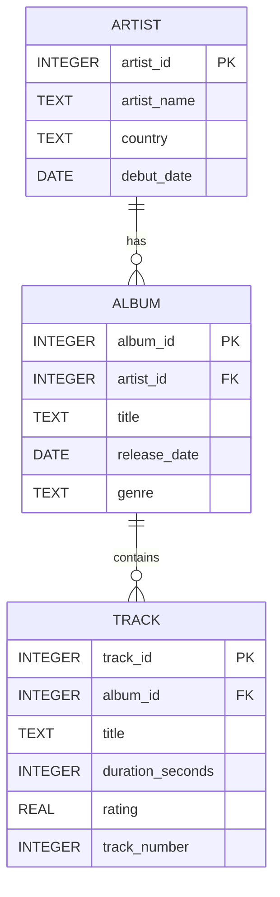

# Rapport – SQL & Databasdesign (Musikbibliotek)

## 1. ER-diagram

Samma modell som i `docs/er_diagram.md`:



## 2. Tabellförklaringar och motiveringar

**Artist** stores artist's identity and metadata. `artist_id` is `INTEGER` for simple, fast key handling. `artist_name` and `country` are `TEXT` since values vary in length. `debut_date` is `DATE` for time-based filtering.

**Album** stores releases and links each album to an artist via `artist_id` (FK). `title` and `genre` are `TEXT` since values are free text. `release_date` is `DATE` for sorting and comparing over time.

**Track** stores tracks for an album via `album_id` (FK). `duration_seconds` is `INTEGER` since seconds are whole numbers. `rating` is `REAL` for decimal values between 0 and 5. `track_number` is `INTEGER` since track number is ordinal data.

`NOT NULL` is used on fields that must exist for the post to be meaningful (e.g. name, title, relationships). `CHECK` is used for quality assurance, e.g. positive track duration and rating within valid range.

## 3. Alla SQL-kommandon

### create_tables.sql

```sql
-- Enable FK checks in SQLite sessions.
PRAGMA foreign_keys = ON;

-- Artist stores one row per music artist and acts as the parent entity for albums.
CREATE TABLE IF NOT EXISTS Artist (
    artist_id INTEGER PRIMARY KEY,
    artist_name TEXT NOT NULL,
    country TEXT NOT NULL,
    debut_date DATE NOT NULL
);

-- Album stores releases and links each album to exactly one artist.
CREATE TABLE IF NOT EXISTS Album (
    album_id INTEGER PRIMARY KEY,
    artist_id INTEGER NOT NULL,
    title TEXT NOT NULL,
    release_date DATE NOT NULL,
    genre TEXT NOT NULL,
    FOREIGN KEY (artist_id) REFERENCES Artist(artist_id)
);

-- Track stores songs and links each track to one album while keeping useful metadata.
CREATE TABLE IF NOT EXISTS Track (
    track_id INTEGER PRIMARY KEY,
    album_id INTEGER NOT NULL,
    title TEXT NOT NULL,
    duration_seconds INTEGER NOT NULL CHECK (duration_seconds > 0),
    rating REAL CHECK (rating BETWEEN 0 AND 5),
    track_number INTEGER NOT NULL CHECK (track_number > 0),
    FOREIGN KEY (album_id) REFERENCES Album(album_id)
);
```

### insert_data.sql

```sql
-- Insert artists first because Album depends on Artist via artist_id.
INSERT INTO Artist (artist_id, artist_name, country, debut_date) VALUES
    (1, 'Northern Echo', 'Sweden', '2012-04-19'),
    (2, 'Velvet Circuit', 'UK', '2015-09-02'),
    (3, 'Solar Harbor', 'Canada', '2010-01-14');

-- Insert albums second because Track depends on Album and Album depends on Artist.
INSERT INTO Album (album_id, artist_id, title, release_date, genre) VALUES
    (1, 1, 'Midnight Transit', '2016-03-11', 'Indie Pop'),
    (2, 1, 'Static Horizon', '2019-10-04', 'Synthwave'),
    (3, 2, 'Signal Bloom', '2018-06-22', 'Alternative Rock'),
    (4, 3, 'Tidal Lights', '2021-02-12', 'Dream Pop');

-- Insert tracks last because each track must reference an existing album_id.
INSERT INTO Track (track_id, album_id, title, duration_seconds, rating, track_number) VALUES
    (1, 1, 'City in Reverse', 214, 4.2, 1),
    (2, 1, 'Neon Rainfall', 189, 4.0, 2),
    (3, 1, 'Glass Platforms', 241, 4.5, 3),
    (4, 2, 'Voltage Tide', 202, 4.3, 1),
    (5, 2, 'Parallel Skies', 233, 4.7, 2),
    (6, 2, 'Afterglow Engine', 256, 4.6, 3),
    (7, 3, 'Faded Receiver', 198, 3.9, 1),
    (8, 3, 'Signal Bloom', 227, 4.4, 2),
    (9, 3, 'Concrete Aurora', 205, 4.1, 3),
    (10, 4, 'Harborline', 219, 4.8, 1),
    (11, 4, 'Low Tide Satellites', 245, 4.5, 2),
    (12, 4, 'Blue Latitude', 231, 4.6, 3);
```

### select_basic.sql

```sql
-- 1) Fetches all artists for a quick overview of basic data.
SELECT artist_id, artist_name, country, debut_date
FROM Artist;

-- 2) Shows albums released after 2018 to demonstrate WHERE on date.
SELECT album_id, title, release_date
FROM Album
WHERE release_date > '2018-12-31';

-- 3) Lists tracks sorted from longest to shortest to demonstrate ORDER BY DESC.
SELECT track_id, title, duration_seconds
FROM Track
ORDER BY duration_seconds DESC;

-- 4) Searches for tracks containing the word "Signal" to demonstrate LIKE matching.
SELECT track_id, title
FROM Track
WHERE title LIKE '%Signal%';

-- 5) Counts the number of albums per genre to demonstrate GROUP BY without HAVING.
SELECT genre, COUNT(*) AS album_count
FROM Album
GROUP BY genre;

-- 6) Calculates the average rating per album to compare quality between albums.
SELECT album_id, ROUND(AVG(rating), 2) AS average_rating
FROM Track
GROUP BY album_id
ORDER BY average_rating DESC;
```

### select_join.sql

```sql
-- 1) Joins Artist and Album to show which artist is behind each album.
SELECT
    ar.artist_name,
    al.title AS album_title,
    al.release_date
FROM Artist ar
INNER JOIN Album al ON al.artist_id = ar.artist_id
ORDER BY ar.artist_name, al.release_date;

-- 2) Connects Album and Track to show the track list with album title and track number.
SELECT
    al.title AS album_title,
    tr.track_number,
    tr.title AS track_title,
    tr.duration_seconds
FROM Album al
INNER JOIN Track tr ON tr.album_id = al.album_id
ORDER BY al.title, tr.track_number;

-- 3) Three-way JOIN (Artist -> Album -> Track) for a complete catalog view.
SELECT
    ar.artist_name,
    al.title AS album_title,
    tr.track_number,
    tr.title AS track_title,
    tr.rating
FROM Artist ar
INNER JOIN Album al ON al.artist_id = ar.artist_id
INNER JOIN Track tr ON tr.album_id = al.album_id
ORDER BY ar.artist_name, al.title, tr.track_number;
```

### updates.sql

```sql
-- Updates release_date after the wrong year was discovered during data input.
UPDATE Album
SET release_date = '2020-10-04'
WHERE album_id = 2;

-- Changes track title after the band released an official "renamed" version.
UPDATE Track
SET title = 'Afterglow Engine (Rework)'
WHERE track_id = 6;
```

### deletes.sql

```sql
-- Removes a specific track from the catalog after the artist's request for correction.
DELETE FROM Track
WHERE track_id = 7;
```

## 4. LINQ comparisons

LINQ (Language Integrated Query) is C#'s way of writing data queries with strong typing and IntelliSense support. In a .NET application using Entity Framework Core, LINQ expressions are usually translated into SQL and executed by the database. This allows the same filtering, sorting, and grouping logic to be written directly in application code without manually building SQL strings. Developers often choose LINQ for readability, safer refactoring, and better compile-time checks.

### Filter albums released after 2018 (WHERE)

**SQL version**

```sql
SELECT album_id, title, release_date
FROM Album
WHERE release_date > '2018-12-31';
```

**LINQ version**

```csharp
// Fetches albums released after 2018-12-31 and materializes the result.
using var context = new MusicLibraryContext();

var albumsAfter2018 = context.Albums
    .Where(a => a.ReleaseDate > new DateTime(2018, 12, 31))
    .Select(a => new
    {
        a.AlbumId,
        a.Title,
        a.ReleaseDate
    })
    .ToList();
```

In SQL, `WHERE` maps directly to `.Where(...)` in LINQ and applies the same filtering logic. The `SELECT` columns map to `.Select(...)`, where we project exactly `AlbumId`, `Title`, and `ReleaseDate`. When `.ToList()` is called, EF Core executes the translated SQL query and materializes the result as a list.

### Sort tracks from longest to shortest (ORDER BY DESC)

**SQL version**

```sql
SELECT track_id, title, duration_seconds
FROM Track
ORDER BY duration_seconds DESC;
```

**LINQ version**

```csharp
// Fetches tracks sorted in descending order by duration in seconds.
using var context = new MusicLibraryContext();

var tracksByLengthDesc = context.Tracks
    .OrderByDescending(t => t.DurationSeconds)
    .Select(t => new
    {
        t.TrackId,
        t.Title,
        t.DurationSeconds
    })
    .ToList();
```

`ORDER BY duration_seconds DESC` in SQL maps to `.OrderByDescending(t => t.DurationSeconds)` in LINQ. The sort key is the same field in both versions, but in LINQ it is expressed as a lambda. After sorting, `.Select(...)` shapes the output before `.ToList()` materializes the data.

### Count albums per genre (GROUP BY + COUNT)

**SQL version**

```sql
SELECT genre, COUNT(*) AS album_count
FROM Album
GROUP BY genre;
```

**LINQ version**

```csharp
// Groups albums by genre and counts how many albums each genre has.
using var context = new MusicLibraryContext();

var albumsPerGenre = context.Albums
    .GroupBy(a => a.Genre)
    .Select(g => new
    {
        Genre = g.Key,
        AlbumCount = g.Count()
    })
    .ToList();
```

`GROUP BY genre` in SQL maps to `.GroupBy(a => a.Genre)` in LINQ, where each group is represented by `g`. The group column is exposed through `g.Key`, which corresponds to `genre` in the SQL output. The `COUNT(*)` aggregate maps to `g.Count()`, and the result is projected into an object with `Genre` and `AlbumCount`.

## 5. Säkerhet

Secure access to databases is critical eftersom databasen ofta innehåller kärndata som kunduppgifter, transaktioner eller annan affärskritisk information. Om backend tillåter osäkra frågor kan en angripare läsa, ändra eller radera data med stora konsekvenser för både drift och integritet. Authentication betyder att systemet verifierar vem användaren eller tjänsten faktiskt är, medan authorization avgör vilka resurser och operationer den identiteten får använda. Ett grundskydd är parameteriserade queries, eftersom de separerar data från SQL-logik och minskar risken för SQL injection. Lösenord ska aldrig lagras i klartext utan hash:as med moderna algoritmer och salter, så att läckta databaser inte direkt avslöjar användarkonton. Databasanvändare bör följa minsta privilegieprincipen, exempelvis read-only för rapportering och separata konton för skrivoperationer. Connection strings och hemligheter ska lagras i environment variables eller secrets manager i stället för i källkod och repository.

## 6. Versionshantering – reflektion

Git är viktigt i databasutveckling eftersom schema och queries förändras över tid och behöver vara spårbara. Med meningsfulla commits går det snabbt att förstå varför en viss tabell, constraint eller query ändrades. Vid felaktiga ändringar kan man göra rollback utan att tappa hela projektets historik. I teamarbete gör branches och pull requests att flera utvecklare kan jobba parallellt med migrationer och datalogik utan att skriva över varandra.

## 7. Personlig reflektion

Det som gick bäst var att bryta ner arbetet i tydliga steg med separata commits, eftersom det gjorde varje del lättare att verifiera och dokumentera. Det svåraste var att hålla balansen mellan enkel modell och tillräckligt robusta constraints för VG-nivå, särskilt kring datatyper och validering av track-data. Jag märkte också att ordningen mellan insert-operationerna är central när foreign keys används, annars blir det direkt referensfel. Om jag gjorde om arbetet skulle jag lägga till ett separat testskript som kör allt i rätt ordning automatiskt för snabbare validering. Jag skulle även komplettera med fler edge case-data, exempelvis album utan betygsatta tracks, för att stress-testa queryresultaten bättre.
